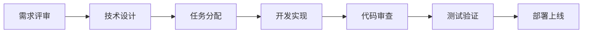

# 团队分工文档 - GPT-OSS-120B AI 对话平台

## 团队组织架构

```
项目负责人 (Project Owner)
    │
    ├── 产品经理 (Product Manager)
    │
    ├── 技术负责人 (Tech Lead)
    │   ├── 前端开发组
    │   │   ├── 前端负责人 (Senior Frontend)
    │   │   └── 前端开发 (Frontend Developer)
    │   │
    │   ├── 后端开发 (Backend Developer)
    │   │
    │   └── AI 工程师 (AI Engineer)
    │
    ├── UI/UX 设计师 (UI/UX Designer)
    │
    └── 测试工程师 (QA Engineer)
```

## 角色职责定义

### 1. 产品经理 (01-ProductManager)

**主要职责：**
- 产品规划和路线图制定
- 需求收集和优先级排序
- 用户研究和竞品分析
- 产品文档编写和维护
- 跨团队协调和沟通
- 项目进度跟踪

**负责输出：**
- PRD 产品需求文档
- 用户故事和验收标准
- 产品路线图
- 发布计划
- 用户反馈分析报告

**工作内容（v1.0）：**
```markdown
Week 1:
- [ ] 完成 PRD 文档细化
- [ ] 制定用户故事
- [ ] 确定 MVP 功能范围
- [ ] 竞品分析（Grok, ChatGPT, Claude）

Week 2:
- [ ] 协调团队日会
- [ ] 跟踪开发进度
- [ ] 准备发布材料
- [ ] 制定上线计划
```

### 2. 技术负责人 (02-TechLead)

**主要职责：**
- 技术架构设计和决策
- 技术方案评审
- 代码质量把控
- 技术难点攻关
- 团队技术指导
- 技术文档维护

**负责输出：**
- 技术架构文档
- 技术选型方案
- 代码规范文档
- API 设计文档
- 性能优化方案

**工作内容（v1.0）：**
```markdown
Week 1:
- [ ] 搭建项目基础架构
- [ ] 制定开发规范
- [ ] LLM API 集成方案设计
- [ ] 代码审查机制建立

Week 2:
- [ ] 技术难点支持
- [ ] 性能优化
- [ ] 部署方案实施
- [ ] 生产环境配置
```

### 3. 前端负责人 (03-SeniorFrontend)

**主要职责：**
- 前端架构设计
- 核心组件开发
- 前端技术选型
- 性能优化
- 前端团队指导

**负责输出：**
- 前端架构设计
- 核心组件库
- 前端开发规范
- 性能优化报告

**工作内容（v1.0）：**
```markdown
Day 1-2:
- [ ] Next.js 项目初始化
- [ ] 目录结构设计
- [ ] 基础组件搭建
- [ ] 主题系统实现

Day 3-5:
- [ ] 聊天界面开发
- [ ] 消息组件实现
- [ ] 流式响应处理
- [ ] Markdown 渲染

Day 6-7:
- [ ] 响应式适配
- [ ] 性能优化
- [ ] 代码审查
- [ ] Bug 修复
```

### 4. 前端开发 (04-FrontendDev)

**主要职责：**
- UI 组件开发
- 页面功能实现
- 样式编写
- Bug 修复
- 单元测试编写

**负责输出：**
- UI 组件
- 页面功能
- 样式文件
- 测试用例

**工作内容（v1.0）：**
```markdown
Day 1-3:
- [ ] 基础 UI 组件开发
- [ ] 输入框组件
- [ ] 按钮组件
- [ ] 加载动画

Day 4-5:
- [ ] 设置面板开发
- [ ] 主题切换功能
- [ ] 本地存储集成
- [ ] 快捷键支持

Day 6-7:
- [ ] 移动端适配
- [ ] 交互优化
- [ ] Bug 修复
- [ ] 测试编写
```

### 5. 后端开发 (05-BackendDev)

**主要职责：**
- API 接口开发
- 数据库设计
- 业务逻辑实现
- 第三方服务集成
- 安全防护

**负责输出：**
- RESTful API
- 数据库模型
- 业务服务
- API 文档

**工作内容（v1.0）：**
```markdown
Day 1-2:
- [ ] API 路由设计
- [ ] 聊天接口开发
- [ ] 流式响应实现
- [ ] 错误处理

Day 3-4:
- [ ] LLM Provider 集成
- [ ] 多模型支持
- [ ] Rate Limiting
- [ ] 缓存机制

Day 5-7:
- [ ] API 优化
- [ ] 安全加固
- [ ] 部署配置
- [ ] 监控集成
```

### 6. AI 工程师 (06-AIEngineer)

**主要职责：**
- LLM 模型集成
- Prompt 工程
- 模型性能优化
- AI 功能开发
- 模型评估

**负责输出：**
- LLM 集成方案
- Prompt 模板
- 模型配置
- 性能报告

**工作内容（v1.0）：**
```markdown
Week 1:
- [ ] GPT-OSS-120B API 研究
- [ ] 多模型 Provider 封装
- [ ] Prompt 优化
- [ ] Token 计算优化

Week 2:
- [ ] 响应质量优化
- [ ] 错误处理改进
- [ ] 性能测试
- [ ] 文档编写
```

### 7. UI/UX 设计师 (07-UIUXDesigner)

**主要职责：**
- 界面设计
- 交互设计
- 设计系统维护
- 用户体验优化
- 设计规范制定

**负责输出：**
- UI 设计稿
- 交互原型
- 设计系统
- 图标和插画

**工作内容（v1.0）：**
```markdown
Day 1-2:
- [ ] 竞品 UI 分析
- [ ] 设计风格确定
- [ ] 颜色和字体方案
- [ ] 组件设计系统

Day 3-4:
- [ ] 主界面设计
- [ ] 响应式设计方案
- [ ] 暗色主题设计
- [ ] 图标设计

Day 5-7:
- [ ] 交互细节优化
- [ ] 设计走查
- [ ] 设计文档
- [ ] 资源输出
```

### 8. 测试工程师 (08-QAEngineer)

**主要职责：**
- 测试计划制定
- 测试用例编写
- 功能测试
- 性能测试
- Bug 跟踪

**负责输出：**
- 测试计划
- 测试用例
- 测试报告
- Bug 列表

**工作内容（v1.0）：**
```markdown
Day 6-7:
- [ ] 测试计划制定
- [ ] 测试用例编写
- [ ] 功能测试执行
- [ ] 兼容性测试

Day 8-9:
- [ ] 性能测试
- [ ] 安全测试
- [ ] Bug 验证
- [ ] 测试报告
```

## 协作流程

### 1. 日常协作



### 2. 沟通机制

**每日站会（Daily Standup）**
- 时间：每天早上 10:00
- 时长：15 分钟
- 内容：昨日完成、今日计划、遇到问题

**周例会（Weekly Meeting）**
- 时间：每周一 14:00
- 时长：1 小时
- 内容：周进度回顾、下周计划、问题讨论

**评审会议（Review Meeting）**
- 需求评审：每个 Sprint 开始
- 技术评审：重大技术决策时
- 代码评审：每个 PR 提交

### 3. 工具链

**项目管理**
- GitHub Projects：任务管理
- Notion：文档协作
- Slack/Discord：即时通讯

**开发工具**
- GitHub：代码托管
- Vercel：部署平台
- Figma：设计协作

**测试工具**
- Jest：单元测试
- Playwright：E2E 测试
- Lighthouse：性能测试

## 任务分配矩阵（v1.0）

| 任务 | PM | TL | SF | FD | BD | AI | UX | QA |
|------|----|----|----|----|----|----|----|----|
| 需求分析 | ● | ○ | | | | | ○ | |
| 技术设计 | ○ | ● | ● | | ● | ● | | |
| UI 设计 | ○ | | | | | | ● | |
| 前端开发 | | ○ | ● | ● | | | | |
| 后端开发 | | ○ | | | ● | ○ | | |
| AI 集成 | | ○ | | | ○ | ● | | |
| 测试 | ○ | | ○ | ○ | ○ | | | ● |
| 部署 | | ● | ○ | | ● | | | |
| 文档 | ● | ● | ○ | ○ | ○ | ○ | ○ | ○ |

**说明：** ● 主要负责 ○ 参与协助

## 里程碑和交付物

### v1.0 里程碑

| 里程碑 | 日期 | 负责人 | 交付物 |
|--------|------|--------|--------|
| M1: 项目启动 | 1/11 | PM | PRD、技术方案 |
| M2: 原型完成 | 1/13 | UX | 设计稿、原型 |
| M3: 核心功能 | 1/17 | TL | 基础对话功能 |
| M4: UI 完成 | 1/18 | SF | 完整界面 |
| M5: 测试完成 | 1/19 | QA | 测试报告 |
| M6: 上线发布 | 1/20 | TL | 生产环境 |

## 风险和依赖

### 风险管理

| 风险 | 概率 | 影响 | 负责人 | 缓解措施 |
|------|------|------|--------|----------|
| API 延迟高 | 中 | 高 | AI | 多Provider备份 |
| UI 适配问题 | 低 | 中 | SF | 提前测试 |
| 需求变更 | 中 | 中 | PM | 锁定MVP范围 |
| 人员不足 | 低 | 高 | TL | 关键路径优先 |

### 外部依赖

1. **LLM API 服务**
   - 依赖方：OpenAI/DeepSeek
   - 风险：服务不稳定
   - 备选：多个 Provider

2. **部署平台**
   - 依赖方：Vercel
   - 风险：部署限制
   - 备选：自建服务器

3. **第三方库**
   - 依赖方：npm packages
   - 风险：版本兼容
   - 备选：锁定版本

## 绩效指标（KPI）

### 团队 KPI

| 角色 | 指标 | 目标值 |
|------|------|--------|
| PM | 按时交付率 | > 90% |
| TL | 代码质量分数 | > 85 |
| SF | 页面性能分数 | > 90 |
| FD | UI 还原度 | > 95% |
| BD | API 可用性 | > 99% |
| AI | 响应准确率 | > 85% |
| UX | 设计满意度 | > 4.5/5 |
| QA | Bug 发现率 | > 90% |

## 知识共享

### 文档规范
- 所有文档使用 Markdown 格式
- 代码注释使用 JSDoc
- API 文档使用 OpenAPI
- 设计文档使用 Figma

### 培训计划
- Next.js 15 新特性分享
- LLM API 集成最佳实践
- 性能优化技巧
- 安全编码规范

### Code Review 规范
- 每个 PR 至少一人审查
- 关注代码质量和性能
- 遵循团队编码规范
- 及时反馈和讨论