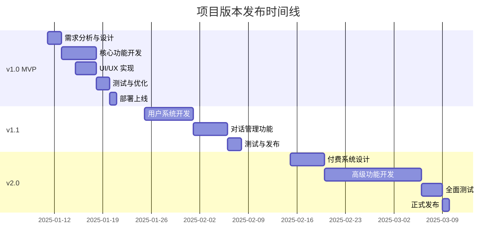

# 版本规划文档 - GPT-OSS-120B AI 对话平台

## 版本路线图总览



## 版本 1.0 - MVP (最小可行产品)

### 发布目标：2025年1月20日

### 核心特性
✅ **必须完成**

#### 1. 基础对话功能
- [ ] 单轮对话实现
- [ ] 多轮对话支持
- [ ] 流式响应输出
- [ ] 对话中断功能
- [ ] 错误处理机制

#### 2. UI/UX 实现
- [ ] 响应式布局（PC/移动端）
- [ ] 暗色/亮色主题切换
- [ ] 输入框组件（支持多行）
- [ ] 消息展示组件
- [ ] 加载状态显示
- [ ] 复制代码功能

#### 3. Markdown 支持
- [ ] Markdown 渲染
- [ ] 代码块语法高亮
- [ ] 表格渲染
- [ ] 链接处理
- [ ] 图片显示（可选）

#### 4. 本地存储
- [ ] 对话历史保存（localStorage）
- [ ] 设置项保存
- [ ] 主题偏好记忆
- [ ] 清空历史功能

#### 5. API 集成
- [ ] LLM API 调用封装
- [ ] 多模型切换支持
- [ ] API Key 配置（环境变量）
- [ ] 错误重试机制

### 技术实现清单

```typescript
// v1.0 核心功能模块
modules = {
  chat: {
    ChatInput: '输入组件',
    ChatDisplay: '显示组件',
    ChatService: '聊天服务',
    StreamHandler: '流处理器'
  },
  storage: {
    LocalStorage: '本地存储',
    IndexedDB: '对话历史'
  },
  ui: {
    Theme: '主题系统',
    Layout: '布局组件',
    Responsive: '响应式设计'
  },
  api: {
    LLMProvider: 'API抽象层',
    ErrorHandler: '错误处理',
    RateLimiter: '限流器'
  }
}
```

### 开发计划

#### 第1周（1月11日-1月17日）
**Day 1-2: 项目初始化与架构搭建**
- 项目脚手架创建
- 基础目录结构
- 核心依赖安装
- 环境配置

**Day 3-5: 核心功能开发**
- API 路由实现
- LLM 集成
- 流式响应处理
- 基础对话逻辑

**Day 6-7: UI 组件开发**
- 聊天界面布局
- 输入输出组件
- 主题系统
- 响应式适配

#### 第2周（1月18日-1月20日）
**Day 8-9: 功能完善与测试**
- Markdown 渲染
- 代码高亮
- 本地存储
- 错误处理

**Day 10: 部署上线**
- 生产环境配置
- Vercel 部署
- 域名配置
- 监控设置

### 质量标准
- ✅ 所有核心功能正常工作
- ✅ 无阻塞性 Bug
- ✅ 移动端完美适配
- ✅ 页面加载 < 3秒
- ✅ API 响应 < 2秒

---

## 版本 1.1 - 用户体验增强

### 发布目标：2025年2月8日

### 新增特性

#### 1. 用户系统
- [ ] 邮箱注册/登录
- [ ] OAuth 登录（Google）
- [ ] 用户资料管理
- [ ] 会话管理

#### 2. 对话管理
- [ ] 对话列表
- [ ] 对话创建/删除
- [ ] 对话重命名
- [ ] 对话搜索
- [ ] 对话分享链接

#### 3. 数据同步
- [ ] 云端存储对话
- [ ] 跨设备同步
- [ ] 导出功能（MD/PDF）
- [ ] 导入历史对话

#### 4. 高级设置
- [ ] 系统提示词自定义
- [ ] 温度参数调节
- [ ] Max Tokens 设置
- [ ] 响应长度控制

#### 5. UI 增强
- [ ] 侧边栏优化
- [ ] 快捷键支持
- [ ] 动画效果
- [ ] 更多主题选项

### 技术升级

```typescript
// v1.1 新增模块
newModules = {
  auth: {
    NextAuth: '认证系统',
    Session: '会话管理',
    JWT: 'Token管理'
  },
  database: {
    Supabase: '数据库服务',
    Prisma: 'ORM工具',
    Migration: '数据迁移'
  },
  sync: {
    CloudSync: '云同步',
    Export: '导出服务',
    Import: '导入服务'
  }
}
```

### 数据库设计

```sql
-- 用户表
CREATE TABLE users (
  id UUID PRIMARY KEY,
  email VARCHAR(255) UNIQUE,
  name VARCHAR(255),
  avatar_url TEXT,
  created_at TIMESTAMP
);

-- 对话表
CREATE TABLE conversations (
  id UUID PRIMARY KEY,
  user_id UUID REFERENCES users(id),
  title VARCHAR(255),
  created_at TIMESTAMP,
  updated_at TIMESTAMP
);

-- 消息表
CREATE TABLE messages (
  id UUID PRIMARY KEY,
  conversation_id UUID REFERENCES conversations(id),
  role VARCHAR(50),
  content TEXT,
  created_at TIMESTAMP
);
```

---

## 版本 2.0 - 商业化版本

### 发布目标：2025年3月9日

### 商业特性

#### 1. 付费系统
- [ ] 积分系统
- [ ] 订阅计划（月/年）
- [ ] 支付集成（Stripe）
- [ ] 发票系统
- [ ] 使用量统计

#### 2. 高级功能
- [ ] GPT-OSS-120B 完整接入
- [ ] 图像理解能力
- [ ] 文件上传分析
- [ ] 联网搜索
- [ ] 自定义插件

#### 3. 团队协作
- [ ] 团队空间
- [ ] 成员管理
- [ ] 权限控制
- [ ] 共享对话
- [ ] 协作编辑

#### 4. 企业功能
- [ ] SSO 单点登录
- [ ] API 访问
- [ ] 私有部署
- [ ] 审计日志
- [ ] 合规性支持

#### 5. 运营工具
- [ ] 管理后台
- [ ] 用户分析
- [ ] 使用报告
- [ ] A/B 测试
- [ ] 反馈系统

### 定价策略

| 计划 | 月付 | 年付 | 特性 |
|------|------|------|------|
| 免费版 | $0 | $0 | 20次/天，基础模型 |
| 个人版 | $9 | $90 | 无限次，所有模型 |
| 团队版 | $29 | $290 | 团队协作，优先支持 |
| 企业版 | 定制 | 定制 | 私有部署，SLA保障 |

### 技术架构升级

```typescript
// v2.0 企业级架构
enterpriseModules = {
  payment: {
    Stripe: '支付处理',
    Billing: '计费系统',
    Invoice: '发票管理'
  },
  enterprise: {
    SSO: 'SAML/OAuth',
    RBAC: '角色权限',
    Audit: '审计日志',
    Compliance: '合规性'
  },
  advanced: {
    Plugins: '插件系统',
    FileUpload: '文件处理',
    WebSearch: '联网搜索',
    ImageAI: '图像理解'
  },
  analytics: {
    Mixpanel: '用户分析',
    Segment: '数据管道',
    Monitoring: '性能监控'
  }
}
```

---

## 持续迭代计划

### 版本 2.1 (Q2 2025)
- 移动 App（React Native）
- 浏览器插件
- API SDK 发布
- 更多 LLM 模型支持

### 版本 2.2 (Q3 2025)
- AI Agent 功能
- 工作流自动化
- 知识库系统
- 多模态支持增强

### 版本 3.0 (Q4 2025)
- 完全自主部署版本
- 联邦学习支持
- 自定义模型训练
- 企业级 SaaS 平台

---

## 发布流程

### 1. 开发环境
```bash
# 分支策略
main          # 生产环境
develop       # 开发环境
feature/*     # 功能分支
hotfix/*      # 紧急修复
```

### 2. 测试流程
- 单元测试：覆盖率 > 70%
- 集成测试：关键流程
- E2E 测试：用户场景
- 性能测试：负载测试
- 安全测试：渗透测试

### 3. 发布检查清单
- [ ] 代码审查完成
- [ ] 测试全部通过
- [ ] 文档更新完成
- [ ] 环境变量配置
- [ ] 数据库迁移准备
- [ ] 回滚方案确认
- [ ] 监控告警设置
- [ ] 发布公告准备

### 4. 发布步骤
1. 创建发布分支
2. 运行测试套件
3. 构建生产版本
4. 部署到预发布环境
5. 烟雾测试
6. 部署到生产环境
7. 验证生产环境
8. 发布公告
9. 监控观察

---

## 风险管理

### 技术风险
| 风险 | 影响 | 缓解措施 |
|------|------|----------|
| API 成本超支 | 高 | 设置限额，缓存优化 |
| 性能瓶颈 | 中 | 负载均衡，CDN加速 |
| 安全漏洞 | 高 | 定期审计，及时更新 |
| 数据丢失 | 高 | 定期备份，多地容灾 |

### 运营风险
| 风险 | 影响 | 缓解措施 |
|------|------|----------|
| 用户增长缓慢 | 中 | 营销推广，SEO优化 |
| 竞争加剧 | 中 | 差异化功能，快速迭代 |
| 合规问题 | 高 | 法律咨询，合规审查 |
| 内容安全 | 高 | 内容过滤，人工审核 |

---

## 成功指标

### v1.0 成功标准
- 日活跃用户 > 100
- 平均会话时长 > 5分钟
- 崩溃率 < 1%
- 用户反馈评分 > 4.0/5

### v1.1 成功标准
- 注册用户 > 1,000
- 留存率 > 30%
- 云端对话 > 10,000
- NPS 分数 > 50

### v2.0 成功标准
- 付费用户 > 100
- MRR > $1,000
- 用户满意度 > 90%
- 流失率 < 5%

---

## 资源需求

### 团队配置
- 前端开发：2人
- 后端开发：1人
- UI/UX 设计：1人
- 产品经理：1人
- 测试工程师：1人

### 基础设施
- Vercel Pro：$20/月
- Supabase：$25/月
- 域名：$15/年
- CDN：$50/月
- 监控服务：$30/月

### 预算估算
- v1.0：$2,000
- v1.1：$5,000
- v2.0：$15,000